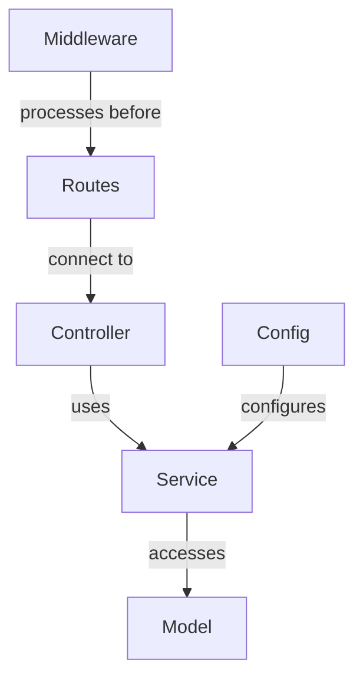

# Architectural Dependency Guide

## Purpose

This guide extends the [Model Dependency Guide](./model-dependency-guide.md) to cover all architectural components in our application. It addresses the need for comprehensive dependency mapping before test implementation to ensure TDD processes work effectively across the entire application stack.

## Architectural Components

Our application consists of these key architectural components, all of which have potential dependencies that must be mapped before implementation:

1. **Models** - Data structures and schemas (covered in [Model Dependency Guide](./model-dependency-guide.md))
2. **Controllers** - Handle HTTP requests and responses
3. **Services** - Contain business logic and model interactions
4. **Routes** - Define API endpoints and connect to controllers
5. **Middleware** - Process requests before they reach routes
6. **Factories** - Create instances of models or other objects
7. **Fixtures** - Provide test data
8. **Mocks** - Simulate behavior of components during testing
9. **Config** - Application configuration
10. **Diagnostics** - Logging, monitoring, and performance tracking

## Dependency Mapping Process by Component Type

### 1. Controllers

#### Key Dependencies to Map

- **Service Dependencies**
  - [ ] Identify all services used by the controller
  - [ ] Document expected service method signatures
  - [ ] Verify error handling between controller and services
  
- **Request/Response Format Dependencies**
  - [ ] Document expected request formats (headers, body, params)
  - [ ] Define response structures and status codes
  - [ ] Identify validation requirements

- **Middleware Dependencies**
  - [ ] List all middleware used by controller routes
  - [ ] Verify authentication/authorization requirements
  - [ ] Identify request transformations by middleware

#### Example Controller Dependency Map

```
Controller: UserController
Service Dependencies:
  - UserService.findById(id: string): Promise<User|null>
  - UserService.updatePreferences(id: string, prefs: object): Promise<User>
  - AuthService.verifyPermission(userId: string, action: string): boolean

Middleware Dependencies:
  - AuthMiddleware (verifies JWT token)
  - ValidationMiddleware (validates request body)
  - RateLimitMiddleware (limits request frequency)

Request Format:
  PUT /api/users/:id/preferences
  - Headers: Authorization (JWT token)
  - Params: id (string, required)
  - Body: { preferences: { stressManagement: {...} } }
```

### 2. Services

#### Key Dependencies to Map

- **Model Dependencies**
  - [ ] Document all models accessed by the service
  - [ ] Specify required model fields and methods
  - [ ] Identify query patterns and indexing needs
  
- **Other Service Dependencies**
  - [ ] Map service-to-service dependencies
  - [ ] Document expected method signatures and return types
  - [ ] Identify potential circular dependencies
  
- **External Dependencies**
  - [ ] List external APIs or services used
  - [ ] Document required configurations for external services
  - [ ] Identify fallback strategies for external failures

#### Example Service Dependency Map

```
Service: StressTechniqueService
Model Dependencies:
  - StressTechnique (all fields)
  - User (preferences.stressManagement fields)
  
Service Dependencies:
  - RecommendationService.getRecommendations(criteria: object): Promise<Recommendation[]>
  - UserService.getUserPreferences(userId: string): Promise<Preferences>
  
External Dependencies:
  - None
```

### 3. Routes

#### Key Dependencies to Map

- **Controller Dependencies**
  - [ ] Map routes to controller methods
  - [ ] Verify parameter passing from routes to controllers
  - [ ] Document expected responses for each route
  
- **Middleware Dependencies**
  - [ ] List middleware applied to each route
  - [ ] Document middleware execution order
  - [ ] Identify route-specific middleware configurations
  
- **Authentication Dependencies**
  - [ ] Specify which routes require authentication
  - [ ] Document permission levels for each route
  - [ ] Map authorization requirements to middleware

#### Example Route Dependency Map

```
Route: /api/stress-techniques/:id
HTTP Methods: GET, PUT, DELETE
Controller: StressTechniqueController
  - GET → getById(id)
  - PUT → updateById(id, data)
  - DELETE → deleteById(id)
  
Middleware Stack (in order):
  1. RequestLogger
  2. Authenticator (GET: optional, PUT/DELETE: required)
  3. Validator (PUT only)
  4. RateLimiter
  
Authentication:
  - GET: Public access
  - PUT: Requires USER role
  - DELETE: Requires ADMIN role
```

### 4. Middleware

#### Key Dependencies to Map

- **Request/Response Dependencies**
  - [ ] Document expected request properties accessed
  - [ ] Identify modifications made to request/response objects
  - [ ] Map error handling patterns

- **Service Dependencies**
  - [ ] List services accessed by middleware
  - [ ] Document expected service method signatures
  - [ ] Verify error handling for service calls

- **Configuration Dependencies**
  - [ ] Identify configuration options used by middleware
  - [ ] Document environment variables needed
  - [ ] Map how configuration affects middleware behavior

#### Example Middleware Dependency Map

```
Middleware: AuthenticationMiddleware
Request Dependencies:
  - headers.authorization (JWT token)
  
Response Modifications:
  - Sets req.user with authenticated user data
  - Sets req.isAuthenticated boolean
  
Service Dependencies:
  - AuthService.verifyToken(token: string): Promise<User|null>
  - UserService.findById(id: string): Promise<User|null>
  
Configuration Dependencies:
  - JWT_SECRET (environment variable)
  - TOKEN_EXPIRY (configurable)
```

### 5. Factories

#### Key Dependencies to Map

- **Model Dependencies**
  - [ ] Document models created by factory
  - [ ] Identify required model fields
  - [ ] Map default values provided by factory
  
- **Configuration Dependencies**
  - [ ] List configuration options affecting factory
  - [ ] Document how configuration changes output
  - [ ] Identify factory initialization requirements

#### Example Factory Dependency Map

```
Factory: StressTechniqueFactory
Creates: StressTechnique model instances

Required Fields:
  - name (string, required)
  - description (string, required)
  - category (string, required)
  
Default Values:
  - difficultyLevel: 'beginner'
  - durationMinutes: 10
  - steps: []
  - tags: []
  
Configuration Dependencies:
  - Default values can be overridden via config
```

### 6. Fixtures

#### Key Dependencies to Map

- **Model Dependencies**
  - [ ] Document models represented in fixtures
  - [ ] Verify required fields are present
  - [ ] Ensure relationships between models are consistent
  
- **Test Dependencies**
  - [ ] Identify which tests use which fixtures
  - [ ] Document how fixtures should be used
  - [ ] Map fixture isolation requirements

#### Example Fixture Dependency Map

```
Fixture: techniques.fixture.ts
Models:
  - StressTechnique (10 sample techniques)
  - Categories (all categories referenced by techniques)
  
Test Usage:
  - StressTechniqueService tests
  - StressTechniqueController tests
  - User recommendation tests
  
Isolation Requirements:
  - Requires clean database before loading
  - Unique identifiers to prevent collisions
```

### 7. Mocks

#### Key Dependencies to Map

- **Component Dependencies**
  - [ ] Document which components are being mocked
  - [ ] Map methods and properties being simulated
  - [ ] Identify side effects of mocked operations
  
- **Test Dependencies**
  - [ ] List tests dependent on these mocks
  - [ ] Document expected mock behavior
  - [ ] Map how mock configuration affects tests

#### Example Mock Dependency Map

```
Mock: StressTechniqueServiceMock
Mocks: StressTechniqueService

Mocked Methods:
  - getTechniqueById(id: string): Returns predefined technique object
  - getAllTechniques(): Returns array of techniques
  - getRecommendedTechniques(userId: string): Returns filtered techniques
  
Test Usage:
  - StressTechniqueController tests
  - Recommendation feature tests
  
Configuration:
  - Can be configured to simulate errors
  - Mock response data can be customized per test
```

### 8. Config

#### Key Dependencies to Map

- **Environment Dependencies**
  - [ ] Document required environment variables
  - [ ] Map default values and fallbacks
  - [ ] Identify validation requirements for config values
  
- **Component Dependencies**
  - [ ] List components dependent on each config value
  - [ ] Map how configuration changes affect components
  - [ ] Document configuration change propagation

#### Example Config Dependency Map

```
Config: stressManagement.config.ts
Environment Variables:
  - MAX_RECOMMENDATION_COUNT (default: 5)
  - DEFAULT_DIFFICULTY_LEVEL (default: 'beginner')
  
Component Dependencies:
  - StressTechniqueService uses MAX_RECOMMENDATION_COUNT
  - StressTechniqueFactory uses DEFAULT_DIFFICULTY_LEVEL
  
Validation:
  - MAX_RECOMMENDATION_COUNT must be 1-20
  - DEFAULT_DIFFICULTY_LEVEL must be 'beginner', 'intermediate', or 'advanced'
```

### 9. Diagnostics

#### Key Dependencies to Map

- **Logging Dependencies**
  - [ ] Document log levels and categories
  - [ ] Map which components use which log types
  - [ ] Identify sensitive data handling in logs
  
- **Performance Metrics**
  - [ ] List metrics being collected
  - [ ] Document components being measured
  - [ ] Map how metrics are used for monitoring

#### Example Diagnostics Dependency Map

```
Diagnostic: StressTechniqueMetrics
Metrics Collected:
  - technique_recommendation_count
  - technique_recommendation_duration_ms
  - technique_usage_by_category
  
Component Integration:
  - StressTechniqueService reports metrics
  - DashboardService consumes metrics
  
Logging:
  - Info level: Successful recommendations
  - Warn level: Slow recommendations (>500ms)
  - Error level: Failed recommendations
```

## Template for Architectural Dependency Documentation

For each new feature that spans multiple architectural components, create a comprehensive dependency map using this format:

```markdown
# [Feature Name] Architectural Dependency Map

## Component Overview



## Detailed Component Requirements

### Controller Dependencies
- Service methods required
- Middleware dependencies
- Request/response formats

### Service Dependencies
- Model fields needed
- Other service integrations
- External dependencies

### Model Dependencies
(See Schema Dependency Map)

### Route Dependencies
- Controller methods mapped
- Middleware requirements
- Authentication needs

### Middleware Dependencies
- Request/response modifications
- Service integrations
- Configuration needs

## Testing Requirements

### Fixtures Needed
- Models to be represented
- Relationships to maintain
- Test coverage

### Mocks Required
- Components to simulate
- Methods to mock
- Test scenarios

## Implementation Sequence

1. Update models first
2. Implement service layer
3. Create controller methods
4. Configure routes
5. Add middleware integration
6. Set up configuration
7. Implement diagnostics
```

## Best Practices for Architectural Dependencies

1. **Map dependencies before writing tests** to ensure complete understanding
2. **Start with model dependencies** as they affect all other components
3. **Work outward from models** to services, controllers, and routes
4. **Document interfaces between components** explicitly
5. **Consider error flows** in addition to happy paths
6. **Identify cross-cutting concerns** like authentication and logging
7. **Plan for configuration changes** that might affect components
8. **Document test requirements** across all architectural layers

## Integration with TDD Process

The Architectural Dependency Map should be created during the Research/Planning phase and verified before test implementation. This ensures that tests are written with comprehensive knowledge of component requirements and interactions.

1. **Map model dependencies** first using the Model Dependency Guide
2. **Document service-level dependencies** next
3. **Map controller and route dependencies** after services
4. **Identify middleware and configuration needs** 
5. **Plan test fixtures and mocks** based on the dependency map
6. **Verify all dependencies** before writing tests
7. **Review the map after test implementation** to catch missed dependencies

> **Pro Tip:** Use the [Architectural Dependency Map Template](../templates/architectural-dependency-map-template.md) to create standardized dependency documentation for your feature.

## Related Documentation

- [Model Dependency Guide](./model-dependency-guide.md)
- [MongoDB Connection Guide](./mongodb-connection-guide.md)
- [Testing Standards](../standards/testing-standards.md)
- [Sprint Four Task Template](../sprints/sprint-four-tasks/_task-template.md) 