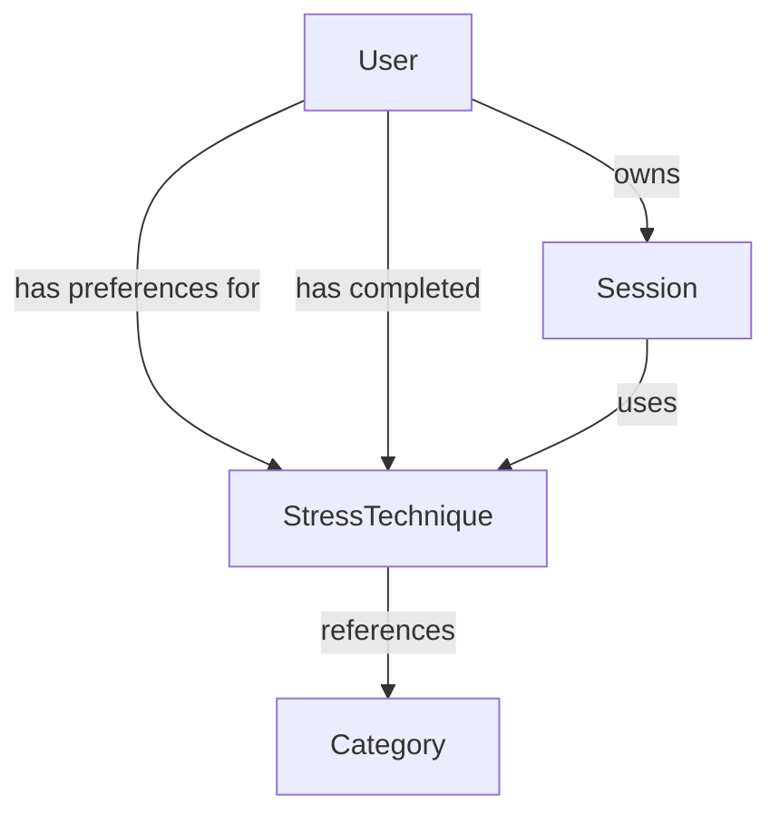
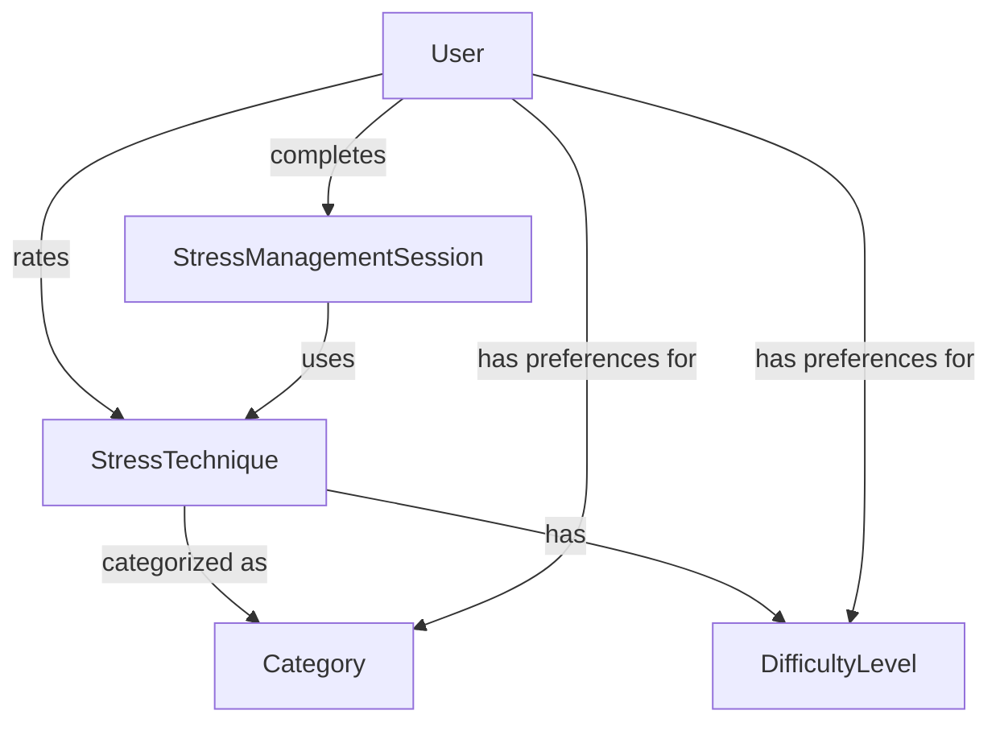

# Model Dependency Guide

## Purpose

This guide addresses a critical gap in our TDD process: ensuring that model dependencies and schema requirements are fully identified **before** writing tests. Incomplete model analysis has led to issues where tests assume fields or relationships that don't yet exist, causing implementation problems and process disruptions.

## When to Use This Guide

- During the Research/Planning phase of any task that:
  - Creates or modifies models
  - Creates features that span multiple models
  - Adds new fields to existing models
  - Establishes new relationships between models
  - Implements functionality that traverses model relationships

## Model Dependency Mapping Process

### 1. Identify All Related Models

**Requirements:**
- [ ] Identify primary models directly affected by the feature
- [ ] Identify secondary models referenced by primary models
- [ ] Identify tertiary models that may be indirectly affected
- [ ] Note existing relationships between these models

**Example:**
```
Primary: StressTechnique
Secondary: User (for preferences)
Tertiary: MeditationSession, StressManagementSession
```

### 2. Create a Visual Schema Dependency Map

**Requirements:**
- [ ] Create a diagram showing models and their relationships
- [ ] Highlight new relationships being established
- [ ] Include field names that establish relationships
- [ ] Show cardinality of relationships (one-to-many, many-to-many, etc.)

**Mermaid Diagram Example:**


### 3. Document Field Requirements for Each Model

**Requirements:**
- [ ] List all fields required for each relevant model
- [ ] Mark existing fields vs. new fields needed
- [ ] Document field types and validation rules
- [ ] Define default values and justify their selection
- [ ] Identify indexing requirements for performance

**Example Field Documentation:**
```
User Model:
- preferences [Object] (NEW)
  - stressManagement [Object] (NEW)
    - preferredCategories [String[]] (NEW)
      - Default: ['breathing', 'meditation']
      - Validation: Must be from allowed categories
    - preferredDuration [Number] (NEW)
      - Default: 10
      - Validation: > 0, < 120
    - difficultyLevel [String] (NEW)
      - Default: 'beginner'
      - Validation: One of ['beginner', 'intermediate', 'advanced']
```

### 4. Validate Existing Models

**Requirements:**
- [ ] Check actual model implementations in code
- [ ] Verify that expected fields exist
- [ ] Validate that relationships are properly established
- [ ] Identify gaps between requirements and implementation
- [ ] Document fields that need to be added to existing models

**Validation Process:**
1. Review model files in `/src/models/`
2. Compare actual schema with requirements
3. Document discrepancies in the Schema Gaps section
4. Plan schema updates before test implementation

### 5. Document Schema Gaps

**Requirements:**
- [ ] Create a table of missing fields or relationships
- [ ] Specify which model each gap affects
- [ ] Provide implementation details for fixing each gap
- [ ] Consider backward compatibility implications
- [ ] Plan testing strategy for schema changes

**Example Schema Gap Table:**
```
| Model | Missing Field/Relationship | Implementation Details | Impact |
|-------|---------------------------|------------------------|--------|
| User  | preferences.stressManagement | Add nested object with default values | Low - New optional field |
| StressTechnique | difficulty | Add string enum field | Medium - Requires data migration |
```

## Example: Stress Management Technique Dependencies

### Model Diagram



### Required Fields

**StressTechnique Model:**
- name [String] - Name of technique
- description [String] - Detailed description
- category [String] - Category of technique (breathing, meditation, etc.)
- difficultyLevel [String] - Difficulty (beginner, intermediate, advanced)
- durationMinutes [Number] - Typical duration
- steps [Array] - Step-by-step instructions
- benefits [Array] - Health benefits
- tags [Array] - Searchable tags

**User Model:**
- preferences [Object]
  - stressManagement [Object]
    - preferredCategories [Array] - Preferred technique types
    - preferredDuration [Number] - Preferred session length
    - difficultyLevel [String] - User's skill level

### Schema Gaps Analysis

**User Model Gaps:**
- Missing preferences.stressManagement object
- Need to add with appropriate defaults
- Low impact change (additive only)

**StressTechnique Model:**
- New model to be created
- Must include all fields listed above
- Validation rules needed for all fields
- Indexes needed for category, difficulty, and text search

### Integration Testing Considerations

- Verify that User preferences affect technique recommendations
- Test that default preferences work correctly when not set
- Ensure technique difficulty filtering works as expected
- Validate that all schema validation rules are enforced

## Best Practices for Model Dependencies

1. **Always map dependencies visually** to identify non-obvious relationships
2. **Check actual model implementations** before writing tests
3. **Document all required fields completely** before implementation
4. **Consider default values carefully** for optional fields
5. **Plan for backwards compatibility** when modifying existing models
6. **Identify indexing needs early** for performance considerations
7. **Consider validation rules** as part of the schema definition
8. **Test schema changes in isolation** before functional tests

## Common Pitfalls

1. **Assuming fields exist** without verifying
2. **Missing nested object structures** (like preferences.stressManagement)
3. **Overlooking validation rules** that may affect test data
4. **Forgetting default values** for optional fields
5. **Missing indirect dependencies** between models
6. **Ignoring indexing requirements** for queries
7. **Overlooking impact of schema changes** on existing functionality

## Integration with TDD Process

The Model Dependency Map must be completed during the Research/Planning phase and verified before test implementation begins. The task template includes these critical checkpoints:

1. **Schema Dependency Map** section in Research Phase
2. **Model Verification Checklist** before Test Implementation
3. **Schema Validation** in Test Implementation Verification

Following this guide ensures that tests are written with complete knowledge of model requirements, preventing the need to modify models during implementation.

> **Pro Tip:** Use the [Schema Dependency Map Template](../templates/schema-dependency-map-template.md) to create standardized dependency documentation for your feature.

## Related Documentation

- [MongoDB Connection Guide](./mongodb-connection-guide.md)
- [Testing Standards](../standards/testing-standards.md)
- [Sprint Four Task Template](../sprints/sprint-four-tasks/_task-template.md) 