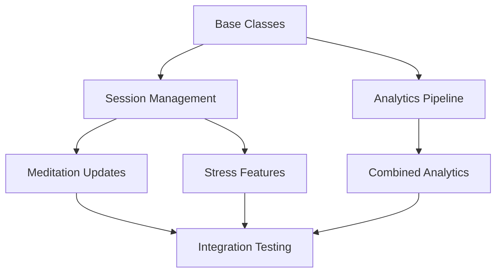

# Implementation Status

[← Back to Main README](../README.md)

## Code Reuse Analysis

### Existing Services to Adapt
1. Session Analytics Service
   - ✅ Generic session tracking methods
   - ✅ Mood tracking (already includes stress states)
   - ✅ User stats aggregation
   - 🔄 Can be extended with:
     - Abstract base class for all wellness sessions
     - Shared analytics interfaces
     - Common stat calculation methods

2. Achievement Service
   - ✅ Achievement processing pipeline
   - ✅ Points system
   - ✅ Progress tracking
   - 🔄 Can be extended with:
     - Stress management achievements
     - Combined wellness milestones
     - Shared progress calculation
   - 🧪 Test Status:
     - 25 skipped tests in `src/__tests__/achievement.test.ts`
     - Tests documented in [Achievement Tests Documentation](testing/achievement-tests-documentation.md)
     - Implementation roadmap in [Test Implementation Roadmap](testing/test-implementation-roadmap.md)
     - Tracking issue: [Achievement System Tracking Issue](testing/achievement-system-tracking-issue.md)

3. Group Session Service
   - ✅ Session management
   - ✅ User participation tracking
   - 🔄 Can be adapted for:
     - Stress support groups
     - Combined wellness sessions
     - Shared session interfaces

### Shared Infrastructure to Extract
1. Base Session Management
   ```typescript
   interface BaseWellnessSession {
     userId: string;
     startTime: Date;
     endTime?: Date;
     duration: number;
     status: 'active' | 'completed' | 'cancelled';
     moodBefore?: MoodState;
     moodAfter?: MoodState;
     notes?: string;
   }
   ```

2. Analytics Pipeline
   ```typescript
   interface WellnessAnalytics {
     sessionStats: SessionStats;
     progressMetrics: ProgressMetrics;
     moodTracking: MoodTracking;
     userAchievements: Achievement[];
   }
   ```

3. Achievement System
   ```typescript
   interface WellnessAchievement {
     type: 'meditation' | 'stress' | 'combined';
     criteria: AchievementCriteria;
     progress: ProgressTracker;
   }
   ```

### Reusable Components
1. Session Base Structure
   - ✅ Existing `MeditationSession` model provides base session tracking
   - ✅ Duration, completion, and interruption tracking
   - ✅ Mood before/after tracking
   - ✅ Notes and feedback system
   - 🔄 Can be extended for stress management sessions

2. Analytics Infrastructure
   - ✅ `SessionAnalytics` model handles session metrics
   - ✅ Mood tracking enums already include stress states
   - ✅ Efficient indexing for querying
   - 🔄 Can be adapted for stress analytics

3. Achievement System
   - ✅ Post-save hooks for achievement processing
   - ✅ Progress tracking integration
   - 🔄 Can be extended for stress management achievements

4. User Progress Tracking
   - ✅ Streak tracking system
   - ✅ Progress metrics
   - 🔄 Can be modified for dual tracking

## Backend Infrastructure Status

### Completed ✅
- Basic Next.js project structure
- MongoDB integration and schema design
- Authentication system implementation
- Core API endpoints
- Basic security measures (JWT, HTTPS)

### In Progress 🚧
- User profile management
- Session handling
- Analytics data collection
- API endpoint expansion

### Pending 📋
- Real-time features
- Advanced security measures
- Performance optimization
- Caching implementation

## Stress Management Implementation

### Data Models & Schema
- [x] Create base session interface for shared functionality
  - [x] Extract common fields from MeditationSession
  - [x] Define shared types and enums
  - [x] Create reusable hooks and methods
  - [x] Tests Required:
    - [x] Base session interface validation tests
    - [x] Hook lifecycle tests
    - [x] Type compatibility tests with existing models

- [x] StressAssessment model (New)
  - [x] Define stress level scale
  - [x] Implement trigger tracking
  - [x] Add physical symptoms tracking
  - [x] Add emotional state tracking
  - [x] Add notes and context fields
  - [x] Tests Required:
    - [x] Model validation tests
    - [x] Scale boundary tests
    - [x] Trigger association tests

- [x] StressManagementSession model (Extend from base session)
  - [x] Inherit common session tracking
  - [x] Add stress-specific fields
  - [x] Reuse mood tracking system
  - [x] Extend analytics integration
  - [x] Tests Required:
    - [x] Inheritance behavior tests
    - [x] Field override tests
    - [x] Analytics integration tests

- [x] CopingStrategy model (New)
  - [x] Strategy categorization
  - [x] Effectiveness tracking
  - [x] Usage statistics
  - [x] Personalization options

- [x] StressTrigger model (New)
  - [x] Trigger categorization
  - [x] Intensity tracking
  - [x] Context recording
  - [x] Pattern recognition fields

### Testing Status
- 🧪 Achievement System Tests
  - **Status**: 25 skipped tests
  - **Reason**: Feature not yet implemented
  - **Documentation**: [Achievement Tests Documentation](testing/achievement-tests-documentation.md)
  - **Implementation Plan**: [Test Implementation Roadmap](testing/test-implementation-roadmap.md)
  - **Review Schedule**: [Test Review Schedule](testing/test-review-schedule.md)
  - **Target Implementation**: Sprints 3-6 (Q2-Q3 2023)

- 🧪 Meditation Session Tests
  - **Status**: 12 skipped tests
  - **Reason**: Features in development
  - **Documentation**: [Meditation Session Tests Documentation](testing/meditation-session-tests.md)
  - **Implementation Plan**: [Test Implementation Roadmap](testing/test-implementation-roadmap.md)
  - **Review Schedule**: [Test Review Schedule](testing/test-review-schedule.md)
  - **Target Implementation**: Sprints 7+ (Q4 2023)

- 🧪 Testing Best Practices Examples
  - **Status**: Completed
  - **Example Files**:
    - [Example Controller with Error Handling](testing/examples/example-controller-with-error-handling.ts)
    - [Example Test with Authentication](testing/examples/example-test-with-authentication.test.ts)
    - [Example MongoDB Test](testing/examples/example-mongodb-test.ts)
    - [Example API Error Handling](testing/examples/example-api-error-handling.ts)
    - [Example Middleware Test](testing/examples/example-middleware-test.test.ts)
  - **Purpose**: These example files demonstrate best practices for testing and error handling based on lessons learned from Sprint One and Two.
  - **Usage**: Developers should reference these examples when implementing new features or tests.

### Controllers & Services
- [x] Create base session controller for shared logic
  - [x] Extract common CRUD operations
  - [x] Define shared validation rules
  - [x] Create reusable error handling

- [x] StressAssessmentController (New)
  - [x] Create assessment endpoint
  - [x] Retrieve history endpoint
  - [x] Update assessment endpoint
  - [x] Delete assessment endpoint
  - [x] Analytics endpoints

- [x] StressManagementController (Extend from base)
  - [x] Reuse session management logic
  - [x] Add stress-specific endpoints
  - [x] Integrate with existing analytics
  - [x] Extend progress tracking

- [x] StressAnalyticsController (Adapt from existing)
  - [x] Reuse analytics infrastructure
  - [x] Add stress-specific metrics
  - [x] Extend trend analysis
  - [x] Integrate with existing insights

### Integration Tasks
- [x] Extend User model for stress preferences
- [x] Modify Progress model for dual tracking
- [x] Update Achievement system
- [x] Enhance Analytics pipeline
- [x] Adapt Notification system

### API Endpoints
- [x] POST /api/stress/assessment
- [x] GET /api/stress/assessment/history
- [x] GET /api/stress/assessment/trends
- [x] POST /api/stress/sessions
- [x] GET /api/stress/sessions/history
- [x] GET /api/stress/techniques
- [x] GET /api/stress/recommendations

### Testing
- [x] Unit tests for models
- [x] Controller integration tests
- [x] API endpoint tests
- [x] Analytics accuracy tests
- [ ] Performance tests

### Documentation
- [x] API documentation
- [x] Data model documentation
- [x] Integration guides
- [x] Testing guides
- [ ] Deployment updates

## Frontend Development Status

### Completed ✅
- Project structure setup
- Basic routing
- Authentication UI
- Core components library setup

### In Progress 🚧
- Meditation timer component
- User profile interface
- Session management UI
- Basic analytics dashboard

### Pending 📋
- Guided meditation interface
- Progress tracking visualizations
- Journal feature
- Settings panel

## Testing Infrastructure

### Completed
- Jest configuration for TypeScript
- MongoDB Memory Server setup
- Basic test utilities
- API testing framework
- Authentication test helpers
- Meditation Session test documentation
- Breathing Exercise test documentation
- PMR Exercise test documentation
- User Authentication test documentation
- Test documentation summary
- Test documentation templates
- Skipped tests documentation
- Test review process
- Test implementation roadmap

### In Progress
- Achievement system test implementation tracking
- Meditation session test implementation tracking
- Integration test expansion

### Pending
- Performance test suite
- E2E test framework
- Mobile-specific test implementation

### Documentation
- [Testing Standards](./documentation/testing-standards.md)
- [Test Documentation Templates](./documentation/test-documentation-templates.md)
- [Achievement Tests Documentation](./documentation/achievement-tests.md)
- [Test Review Schedules](./documentation/test-review-schedules.md)
- [Meditation Session Tests](./documentation/meditation-session-tests.md)
- [Breathing Exercise Tests](./documentation/breathing-exercise-tests.md)
- [PMR Exercise Tests](./documentation/pmr-exercise-tests.md)
- [User Authentication Tests](./documentation/user-authentication-tests.md)
- [Test Documentation Summary](./documentation/test-documentation-summary.md)

### Tracking Issues
- [Achievement System Tests Tracking](./testing/achievement-system-tracking-issue.md) - Tracks 25 skipped tests for the Achievement System
- [Meditation Session Tests Tracking](./testing/meditation-session-tracking-issue.md) - Tracks 12 skipped tests for Meditation Session functionality

## Development Workflow & Dependencies

### Development Order
1. Base Infrastructure (Priority 1)
   - ⚡ Base abstract classes and interfaces first
   - ⚡ Shared test infrastructure
   - ⚡ Common utilities and helpers
   
2. Core Features (Priority 2)
   - ⚡ Session management adaptations
   - ⚡ Analytics pipeline updates
   - ⚡ Achievement system extensions

3. New Features (Priority 3)
   - ⚡ Stress-specific implementations
   - ⚡ Combined wellness features
   - ⚡ Extended analytics

### Critical Path Dependencies


### Risk Mitigation
1. Technical Risks
   - 🛡️ Backward compatibility checks
   - 🛡️ Performance impact monitoring
   - 🛡️ Data migration strategy

2. Testing Risks
   - 🛡️ Regression test automation
   - 🛡️ Integration test coverage
   - 🛡️ Performance test baselines

3. Development Risks
   - 🛡️ Feature toggle system
   - 🛡️ Rollback procedures
   - 🛡️ Monitoring and alerts

## Integration Points [Enhanced]

### Data Layer Integration
- [ ] Schema versioning strategy
- [ ] Migration scripts
- [ ] Data validation rules
- [ ] Indexing strategy updates

### Service Layer Integration
- [ ] Service discovery updates
- [ ] Error handling standardization
- [ ] Retry policies
- [ ] Circuit breakers

### API Layer Integration
- [ ] API versioning strategy
- [ ] Documentation updates
- [ ] Client library updates
- [ ] Breaking change management

### UI/UX Integration
- [ ] Component hierarchy updates
- [ ] State management adaptation
- [ ] Navigation flow updates
- [ ] Error boundary implementation

## Quality Assurance Strategy

### Code Quality
- [ ] Shared code style guide
- [ ] Common patterns documentation
- [ ] Code review checklist
- [ ] Performance benchmarks

### Testing Strategy
- [ ] Test pyramid definition
- [ ] Coverage requirements
- [ ] Performance test criteria
- [ ] Integration test scope

### Monitoring & Observability
- [ ] Metrics collection
- [ ] Error tracking
- [ ] Performance monitoring
- [ ] User behavior analytics

## Next Steps
1. Complete stress management models
2. Implement core stress tracking endpoints
3. Add stress session management
4. Integrate with existing analytics
5. Update progress tracking for dual features

## AI Assistant Usage Guide

### Document Navigation Priorities
1. Initial Assessment
   ```typescript
   // Order of evaluation for new tasks
   const evaluationOrder = {
     first: 'Existing Services to Adapt',    // Check what exists
     second: 'Shared Infrastructure',        // Review shared components
     third: 'Development Workflow',          // Understand dependencies
     fourth: 'Test Requirements'             // Review test needs
   }
   ```

2. Implementation Sequence
   ```typescript
   // Required sequence for implementing changes
   const implementationSequence = {
     1: 'Review existing code structure',
     2: 'Check test requirements',
     3: 'Validate type safety',
     4: 'Implement changes',
     5: 'Update/create tests',
     6: 'Verify integration'
   }
   ```

### Decision Points
1. Code Modification
   ```typescript
   interface ModificationDecision {
     shouldModifyExisting: boolean;    // Can we extend existing code?
     requiresNewImplementation: boolean;// Need new implementation?
     impactAssessment: {
       existingFeatures: string[];     // What features are affected?
       existingTests: string[];        // What tests need updates?
       riskLevel: 'low' | 'medium' | 'high';
     }
   }
   ```

2. Test Strategy
   ```typescript
   interface TestStrategy {
     reuseExistingTests: boolean;      // Can we reuse tests?
     requiresNewTests: boolean;         // Need new tests?
     testDependencies: {
       sharedBehaviors: string[];      // What behaviors to test?
       fixtures: string[];             // What fixtures needed?
       mocks: string[];               // What mocks required?
     }
   }
   ```

### Validation Checkpoints
1. Before Implementation
   ```typescript
   interface PreImplementationChecks {
     codebaseUnderstanding: boolean;   // Do we understand existing code?
     testCoverageIdentified: boolean;  // Have we identified test needs?
     dependenciesChecked: boolean;     // Have we checked dependencies?
     typeSafetyPlanned: boolean;       // Is type safety considered?
   }
   ```

2. During Implementation
   ```typescript
   interface ImplementationChecks {
     followingPatterns: boolean;       // Following established patterns?
     maintainingTypes: boolean;        // Maintaining type safety?
     updatingTests: boolean;           // Updating tests as we go?
     documentingChanges: boolean;      // Documenting changes?
   }
   ```

3. Post Implementation
   ```typescript
   interface PostImplementationChecks {
     testsUpdated: boolean;            // All tests updated?
     typeSafetyVerified: boolean;      // Type safety verified?
     integrationVerified: boolean;     // Integration verified?
     documentationUpdated: boolean;     // Documentation updated?
   }
   ```

### Common Pitfalls to Avoid
1. Type Safety Issues
   ```typescript
   const typeIssues = {
     implicitAny: 'Avoid implicit any types',
     missingGenerics: 'Always specify generic types',
     incompleteInterfaces: 'Ensure interface completeness',
     partialTypes: 'Be explicit about partial types'
   }
   ```

2. Test Coverage Gaps
   ```typescript
   const coverageGaps = {
     missingEdgeCases: 'Always test edge cases',
     incompleteValidation: 'Validate all parameters',
     sharedBehaviors: 'Test shared behaviors',
     asyncHandling: 'Test async operations'
   }
   ```

## Test Analysis & Modifications

### Test Planning & Validation Checklist

1. Type Safety Review
   ```typescript
   interface TestTypeValidation {
     // Required for every test suite
     typeChecks: {
       parameterTypes: boolean;    // All parameters properly typed
       returnTypes: boolean;       // Return types explicitly defined
       genericTypes: boolean;      // Generic type constraints verified
       nullableTypes: boolean;     // Null/undefined handling verified
       enumTypes: boolean;         // Enum value coverage complete
     };
     
     // Required for shared/base tests
     inheritanceChecks: {
       baseClassContracts: boolean;   // Base class requirements met
       interfaceContracts: boolean;   // Interface requirements met
       overrideTypes: boolean;        // Method override types match
     };
   }
   ```

2. Parameter Validation Matrix
   ```typescript
   // Required validation cases per parameter
   type ValidationCase = {
     required: boolean;      // Required parameter tests
     optional: boolean;      // Optional parameter tests
     defaultValue: boolean;  // Default value tests
     boundary: boolean;      // Boundary value tests
     type: boolean;         // Type coercion tests
     format: boolean;       // Format validation tests
   };
   ```

3. Pre-Implementation Test Review
   ```typescript
   // src/__tests__/planning/test-requirements.ts
   interface TestRequirements {
     featureName: string;
     testScope: {
       unit: TestCoverage[];
       integration: TestCoverage[];
       e2e: TestCoverage[];
     };
     typeValidation: TestTypeValidation;
     parameterValidation: Record<string, ValidationCase>;
     edgeCases: string[];
     regressionRisks: string[];
   }
   ```

### Test Implementation Guidelines

1. Type Safety Implementation
   - [ ] Create type validation helpers
     ```typescript
     // src/__tests__/utils/type-validators.ts
     export const typeValidators = {
       validateParameterTypes: <T>(param: T, expectedType: any) => {...},
       validateReturnTypes: <T>(result: T, expectedType: any) => {...},
       validateNullability: <T>(value: T | null) => {...}
     }
     ```

2. Parameter Validation Implementation
   - [ ] Create parameter test factories
     ```typescript
     // src/__tests__/utils/param-validators.ts
     export const parameterTests = {
       required: (param: string) => ({
         valid: () => {...},
         invalid: () => {...},
         missing: () => {...}
       }),
       optional: (param: string) => ({
         present: () => {...},
         absent: () => {...},
         default: () => {...}
       })
     }
     ```

3. Test Case Generation
   - [ ] Automated test case generator
     ```typescript
     // src/__tests__/utils/test-generator.ts
     export const generateTests = (
       requirements: TestRequirements
     ) => {
       return {
         typeTests: generateTypeTests(requirements),
         parameterTests: generateParameterTests(requirements),
         edgeCaseTests: generateEdgeCaseTests(requirements)
       }
     }
     ```

### Pre-Implementation Checklist

Before implementing or modifying any test:

1. Type Safety Checklist
   - [ ] All parameters have explicit types
   - [ ] Return types are declared
   - [ ] Generic constraints are defined
   - [ ] Nullable values are handled
   - [ ] Type guards are implemented where needed

2. Parameter Validation Checklist
   - [ ] Required parameters
     - [ ] Presence validation
     - [ ] Type validation
     - [ ] Format validation
   - [ ] Optional parameters
     - [ ] Default value testing
     - [ ] Undefined handling
     - [ ] Null handling
   - [ ] Complex parameters
     - [ ] Object structure validation
     - [ ] Array content validation
     - [ ] Nested property validation

3. Edge Case Checklist
   - [ ] Boundary values
   - [ ] Empty/null states
   - [ ] Invalid formats
   - [ ] Type mismatches
   - [ ] Overflow conditions

4. Integration Checklist
   - [ ] Service dependencies identified
   - [ ] Mock requirements documented
   - [ ] State management verified
   - [ ] Error propagation tested

### Shared Test Suites Strategy

1. Common Test Behaviors
   ```typescript
   // src/__tests__/shared/wellness-session.behavior.ts
   export const sharedSessionBehaviors = {
     validateSessionLifecycle: (session: BaseWellnessSession) => {
       test('handles start/end timestamps')
       test('calculates duration')
       test('manages state transitions')
       test('tracks mood changes')
     },
     validateProgressTracking: (session: BaseWellnessSession) => {
       test('records milestones')
       test('updates streak counts')
       test('calculates achievements')
     }
   }
   ```

2. Reusable Test Fixtures
   ```typescript
   // src/__tests__/shared/wellness-fixtures.ts
   export const sharedTestData = {
     userStates: {
       beforeSession: {...},
       duringSession: {...},
       afterSession: {...}
     },
     progressScenarios: {...},
     achievementConditions: {...}
   }
   ```

3. Example Usage
   ```typescript
   // src/__tests__/features/meditation/session.test.ts
   describe('MeditationSession', () => {
     it('implements common session behaviors', () => {
       sharedSessionBehaviors.validateSessionLifecycle(meditationSession)
     })
     // Meditation-specific tests...
   })

   // src/__tests__/features/stress/session.test.ts
   describe('StressSession', () => {
     it('implements common session behaviors', () => {
       sharedSessionBehaviors.validateSessionLifecycle(stressSession)
     })
     // Stress-specific tests...
   })
   ```

### Test Refactoring Opportunities

1. Session Management Tests
   - Extract to: `src/__tests__/shared/session-management.test.ts`
   ```typescript
   export const sessionTestSuite = {
     basics: {
       creation: () => {...},
       validation: () => {...},
       stateManagement: () => {...}
     },
     tracking: {
       duration: () => {...},
       progress: () => {...},
       completion: () => {...}
     }
   }
   ```

2. Analytics Tests
   - Extract to: `src/__tests__/shared/analytics.test.ts`
   ```typescript
   export const analyticsTestSuite = {
     metrics: {
       calculation: () => {...},
       aggregation: () => {...}
     },
     reporting: {
       daily: () => {...},
       weekly: () => {...},
       monthly: () => {...}
     }
   }
   ```

3. Achievement Tests
   - Extract to: `src/__tests__/shared/achievements.test.ts`
   ```typescript
   export const achievementTestSuite = {
     progression: {
       milestones: () => {...},
       streaks: () => {...}
     },
     rewards: {
       points: () => {...},
       badges: () => {...}
     }
   }
   ```

### Test Migration Strategy [Updated]
1. Identify common test patterns
2. Extract shared test behaviors
3. Create reusable test fixtures
4. Refactor existing tests to use shared suites
5. Add feature-specific extensions
6. Verify both individual and combined scenarios

### Impact on Existing Passing Tests

1. Mindfulness Feature Tests
   - 🔍 `MeditationSession` Tests
     - Review needed when: Base class extraction, mood state changes
     - Affected files:
       ```
       src/__tests__/features/meditation/session.test.ts
       src/__tests__/features/meditation/timer.test.ts
       src/__tests__/features/meditation/guidance.test.ts
       ```

   - 🔍 `MoodTracking` Tests
     - Review needed when: Dual tracking implementation, state enum updates
     - Affected files:
       ```
       src/__tests__/features/mood/tracking.test.ts
       src/__tests__/features/mood/history.test.ts
       ```

   - 🔍 `Achievement` Tests
     - Review needed when: Adding stress achievements, modifying point system
     - Affected files:
       ```
       src/__tests__/features/achievements/*.test.ts
       ```

2. Design Change Impact Matrix
   ```

### Reference Test Examples & Patterns

1. Complex Integration Test Examples
   ```typescript
   // src/__tests__/examples/complex-integration.test.ts
   describe('Achievement System Integration', () => {
     // Example: Complex state management with multiple features
     it('handles cross-feature achievement tracking', async () => {
       // Setup example showing proper type handling
       const user = await createTestUser<WellnessUser>({
         id: 'test-user',
         preferences: { notifications: true }
       });

       // Example of handling multiple async operations
       const [meditationSession, stressSession] = await Promise.all([
         createMeditationSession(user),
         createStressSession(user)
       ]);

       // Example of complex state validation
       const achievementState = await trackCombinedProgress({
         meditation: meditationSession,
         stress: stressSession,
         user
       });

       // Example of comprehensive assertions
       expect(achievementState).toMatchObject({
         type: 'combined',
         progress: expect.any(Number),
         milestones: expect.arrayContaining([
           expect.objectContaining({
             type: expect.stringMatching(/^(meditation|stress)$/),
             completed: expect.any(Boolean)
           })
         ])
       });
     });
   });
   ```

2. Type-Safe Mock Examples
   ```typescript
   // src/__tests__/examples/type-safe-mocks.test.ts
   describe('Analytics Service with Type-Safe Mocks', () => {
     // Example: Properly typed mock factory
     const createAnalyticsMock = (): jest.Mocked<AnalyticsService> => ({
       trackSession: jest.fn<Promise<void>, [SessionData]>(),
       calculateMetrics: jest.fn<Promise<Metrics>, [string, TimeRange]>(),
       aggregateStats: jest.fn<Promise<AggregateStats>, [string[]]>()
     });

     // Example: Type-safe test helpers
     const validateMetricsResponse = (
       metrics: Metrics
     ): TypeGuardResult<Metrics> => {
       // Type validation implementation
     };
   });
   ```

3. Edge Case Test Patterns
   ```typescript
   // src/__tests__/examples/edge-cases.test.ts
   describe('Session State Management Edge Cases', () => {
     // Example: Handling complex state transitions
     it('maintains data integrity during interrupted sessions', async () => {
       const session = await createTestSession({
         type: 'meditation',
         duration: 1800 // 30 minutes
       });

       // Example of timing-sensitive operations
       jest.useFakeTimers();
       
       // Example of complex state mutation
       await session.start();
       jest.advanceTimersByTime(900); // 15 minutes
       await session.interrupt('network_error');

       // Example of comprehensive state validation
       expect(session).toMatchInlineSnapshot(`
         Object {
           "actualDuration": 900,
           "status": "interrupted",
           "recoveryPoint": expect.any(Object),
           "metrics": expect.objectContaining({
             "partialProgress": expect.any(Number)
           })
         }
       `);
     });
   });
   ```

4. Shared Test Utilities Example
   ```typescript
   // src/__tests__/examples/shared-utilities.test.ts
   // Example: Reusable test utilities with proper typing
   export const testUtils = {
     // Example: Type-safe fixture creation
     createFixture: <T extends WellnessSession>(
       type: SessionType,
       overrides?: Partial<T>
     ): Promise<T> => {
       // Implementation
     },

     // Example: Strongly typed assertions
     assertValidSession: <T extends WellnessSession>(
       session: T,
       expectedType: SessionType
     ): void => {
       // Implementation
     },

     // Example: Complex state generators
     generateTestScenario: (
       complexity: 'simple' | 'medium' | 'complex'
     ): TestScenario => {
       // Implementation
     }
   };
   ```

5. Migration Test Examples
   ```typescript
   // src/__tests__/examples/migration-patterns.test.ts
   describe('Test Migration Patterns', () => {
     // Example: Converting single-feature to multi-feature test
     it('demonstrates migration from meditation-only to combined test', () => {
       // Before: Single feature
       const oldTest = async () => {
         const session = await createMeditationSession();
         // Old assertions
       };

       // After: Multi-feature support
       const newTest = async () => {
         const baseSession = await createWellnessSession('meditation');
         // New type-safe assertions
       };
     });
   });
   ```

These examples demonstrate:
- Proper TypeScript type usage
- Complex async operation handling
- Comprehensive state validation
- Edge case coverage
- Test utility patterns
- Migration strategies

### Common Test Failures & Prevention

1. MongoDB Connection Issues
   ```typescript
   // INCORRECT: Multiple connection attempts
   beforeAll(async () => {
     await mongoose.connect(process.env.MONGODB_TEST_URI);
   });
   
   // CORRECT: Use shared connection manager
   beforeAll(async () => {
     await dbHelper.connect();
   });
   ```
   
   For comprehensive guidance on MongoDB connection best practices, see our dedicated guide: 
   [MongoDB Connection Guide](./guides/mongodb-connection-guide.md)

2. Type Safety Failures
   ```typescript
   // INCORRECT: Assuming non-nullable properties
   expect(result._id).toBeDefined();
   
   // CORRECT: Type-safe assertions
   expect(result).toHaveProperty('_id');
   expect(result._id).toBeDefined();
   ```

3. Missing Module Errors
   ```typescript
   // COMMON ERROR: Cannot find module '../models/user-points.model'
   
   // PREVENTION CHECKLIST:
   // 1. Verify file exists at correct path
   // 2. Check for circular dependencies
   // 3. Ensure consistent import paths (relative vs absolute)
   // 4. Use path aliases consistently
   ```

4. Database State Management
   ```typescript
   // INCORRECT: Assuming clean database
   test('should create new record', async () => {
     const result = await Model.create(data);
     expect(await Model.countDocuments()).toBe(1);
   });
   
   // CORRECT: Explicitly manage database state
   beforeEach(async () => {
     await Model.deleteMany({});
   });
   
   test('should create new record', async () => {
     const result = await Model.create(data);
     expect(result).toHaveProperty('_id');
   });
   ```

5. Asynchronous Test Handling
   ```typescript
   // INCORRECT: Not awaiting promises
   test('should process data', () => {
     service.processData().then(result => {
       expect(result).toBe(expected);
     });
   });
   
   // CORRECT: Properly await async operations
   test('should process data', async () => {
     const result = await service.processData();
     expect(result).toBe(expected);
   });
   ```

### Test Environment Setup Requirements

1. Database Connection Management
   ```typescript
   // src/__tests__/helpers/db.ts
   export const dbHelper = {
     connect: async () => {
       if (mongoose.connection.readyState === 0) {
         await mongoose.connect(process.env.MONGODB_TEST_URI || 'mongodb://localhost:27017/test');
       }
       return mongoose.connection;
     },
     disconnect: async () => {
       await mongoose.connection.close();
     },
     clearDatabase: async () => {
       if (mongoose.connection.readyState !== 0) {
         const collections = mongoose.connection.collections;
         for (const key in collections) {
           await collections[key].deleteMany({});
         }
       }
     }
   };
   ```

2. Test Data Factory Requirements
   ```typescript
   // src/__tests__/helpers/factories.ts
   export const createTestUser = (overrides = {}) => {
     return {
       _id: new mongoose.Types.ObjectId(),
       username: `test-user-${Date.now()}`,
       email: `test-${Date.now()}@example.com`,
       ...overrides
     };
   };
   
   export const createTestSession = (userId, overrides = {}) => {
     return {
       _id: new mongoose.Types.ObjectId(),
       userId,
       startTime: new Date(),
       duration: 300,
       status: 'active',
       ...overrides
     };
   };
   ```

3. Mock Requirements
   ```typescript
   // src/__tests__/helpers/mocks.ts
   export const mockUserService = {
     getUserPreferences: jest.fn().mockResolvedValue({
       preferredTechniques: ['BREATHING', 'MEDITATION'],
       notificationPreferences: {
         reminders: true,
         frequency: 'DAILY'
       }
     })
   };
   
   export const mockMongooseId = (id = '507f1f77bcf86cd799439011') => {
     return new mongoose.Types.ObjectId(id);
   };
   ```

## Feature Implementation Status

### Core Features

#### 1. Authentication & User Management
- ✅ User registration and login
- ✅ JWT authentication
- ✅ User profile management
- ✅ Password reset functionality
- 🚧 Role-based authorization
- 🚧 Social authentication integration

#### 2. Meditation Features
- ✅ Basic meditation timer
- ✅ Guided meditation playback
- ✅ Meditation history tracking
- ✅ Session analytics
- 🚧 Custom meditation creation
- 🚧 Offline meditation support
- 📋 Advanced analytics and insights

##### Meditation Session Testing Status
- ✅ Basic session creation and completion tests
- ✅ Session analytics tests
- ✅ Integration tests with user system
- 🚧 Extended session customization tests (12 skipped tests)
- 📋 Performance tests for analytics queries
- 📋 E2E tests for meditation session flow
- 📋 Mobile-specific tests for meditation UI

**Test Documentation**: [Meditation Session Tests](./documentation/meditation-session-tests.md)  
**Implementation Tracking**: [Meditation Session Tests Tracking](./testing/meditation-session-tracking-issue.md)

**Test Categories**:
- Session Creation and Management: Tests for creating sessions with additional parameters
- Analytics and Reporting: Tests for generating detailed analytics reports
- User Progress Tracking: Tests for tracking user progress milestones
- Mood Tracking: Tests for analyzing mood patterns over time

**Implementation Timeline**:
- Sprint 3: Basic model extensions
- Sprint 4: Analytics enhancements
- Sprint 5: Progress tracking integration

#### 3. Achievement System
- ✅ Basic achievement structure
- 🚧 Achievement awarding logic
- 🚧 Progress tracking
- 📋 Social sharing
- 📋 Custom achievements
- 📋 Achievement notifications

##### Achievement System Testing Status
- ✅ Basic achievement model tests
- 🚧 Achievement awarding tests (25 skipped tests)
- 📋 Achievement notification tests
- 📋 Social sharing tests
- 📋 Achievement analytics tests

**Test Documentation**: [Achievement Tests Documentation](./documentation/achievement-tests.md)  
**Implementation Tracking**: [Achievement System Tests Tracking](./testing/achievement-system-tracking-issue.md)

**Test Categories**:
- Time-based Achievements: Tests for achievements awarded based on meditation session timing
- Duration-based Achievements: Tests for achievements awarded based on session length
- Streak-based Achievements: Tests for achievements awarded for consistent practice
- Mood-based Achievements: Tests for achievements related to mood improvement

**Implementation Timeline**:
- Sprint 3: Basic model extensions and achievement tracking
- Sprint 4: Time-based and duration-based achievements
- Sprint 5: Streak-based and mood-based achievements
- Sprint 6: Points system and advanced achievement features

#### 4. Analytics & Reporting

## Sprint Four Features (Additional)
- [x] Implement Stress Management Techniques library
  - [x] Create model and schema
  - [x] Implement CRUD operations
  - [x] Add user preferences support
  - [x] Implement recommendations based on stress levels
  - [x] API endpoints for techniques

- [x] Data Export Functionality
  - [x] Create export controller
  - [x] Implement JSON and CSV export
  - [x] Add user data export
  - [x] Add stress assessment export
  - [x] Add achievements export
  
- [x] API Documentation
  - [x] Set up Swagger/OpenAPI
  - [x] Document all endpoints
  - [x] Include authentication information
  - [x] Add examples and response schemas

## Frontend Development Status

### Completed ✅
- Project structure setup
- Basic routing
- Authentication UI
- Core components library setup

### In Progress 🚧
- Meditation timer component
- User profile interface
- Session management UI
- Basic analytics dashboard

### Pending 📋
- Guided meditation interface
- Progress tracking visualizations
- Journal feature
- Settings panel