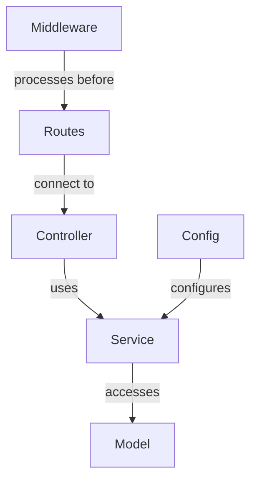

# [Feature Name] Architectural Dependency Map

## Component Overview



## Component Dependencies

### Model Dependencies
*See separate [Schema Dependency Map](./schema-dependency-map.md)*

### Service Dependencies

| Service | Required Methods | Dependencies | Notes |
|---------|------------------|--------------|-------|
| ServiceName | methodName(param: type): returnType | ModelName, OtherService | Description of what this service does |

#### Service Method Signatures
```typescript
// Document method signatures in TypeScript
interface ServiceName {
  methodOne(param1: string, param2: number): Promise<ReturnType>;
  methodTwo(id: string): Promise<boolean>;
}
```

### Controller Dependencies

| Controller | Methods | Service Dependencies | Middleware |
|------------|---------|----------------------|------------|
| ControllerName | methodName | ServiceName.method | auth, validation |

#### Request/Response Format
```
Endpoint: /api/resource/:param
Method: GET
Headers: Authorization (required)
Query Parameters: 
  - filter (optional): string
  - limit (optional): number
Response Format:
  - data: object[]
  - pagination: { total, page, limit }
  - success: boolean
```

### Route Dependencies

| Route Path | Methods | Controller Methods | Middleware Stack | Auth Requirements |
|------------|---------|-------------------|------------------|-------------------|
| /api/resource | GET, POST | get, create | [logger, auth, validator] | User role |

### Middleware Dependencies

| Middleware | Purpose | Dependencies | Modifications |
|------------|---------|--------------|--------------|
| AuthMiddleware | Authentication | AuthService, UserService | Adds req.user object |

### Configuration Dependencies

| Config | Default | Environment Variable | Components Affected |
|--------|---------|----------------------|---------------------|
| maxLimit | 50 | API_MAX_LIMIT | PaginationMiddleware |

## Test Requirements

### Fixtures Needed

| Fixture | Models | Purpose | Test Files |
|---------|--------|---------|------------|
| resource.fixture.ts | Resource, Category | Resource testing | resource.service.test.ts |

### Mock Requirements

| Mock | Component | Methods | Test Files |
|------|-----------|---------|------------|
| ResourceServiceMock | ResourceService | getById, create | resource.controller.test.ts |

## Integration Points

| Component | Integrates With | Integration Type | Notes |
|-----------|----------------|------------------|-------|
| ResourceService | NotificationService | Method call | Notifies on creation |

## Implementation Sequence

1. Update model schema
2. Create/update service layer
3. Implement controller methods
4. Configure routes
5. Test component interactions

## Potential Issues and Risks

| Issue | Likelihood | Impact | Mitigation |
|-------|------------|--------|------------|
| Circular dependency | Medium | High | Use dependency injection |

## Related Documentation

- [Model Dependency Guide](../guides/model-dependency-guide.md)
- [Architectural Dependency Guide](../guides/architectural-dependency-guide.md)
- [Schema Dependency Map](./schema-dependency-map.md) 