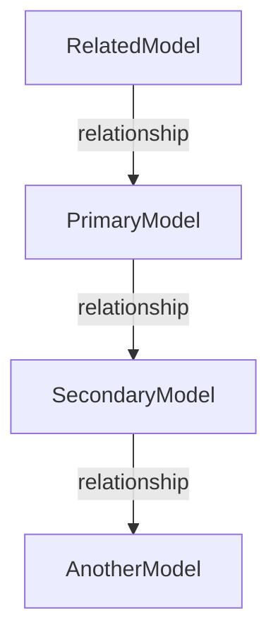

# Schema Dependency Map: [Feature Name]

## Models Overview



## Detailed Model Requirements

### [PrimaryModel] Requirements
| Field | Type | Exists? | Default | Validation | Notes |
|-------|------|---------|---------|------------|-------|
| field1 | String | ✅ | N/A | Required | Existing field |
| field2 | Number | ❌ | 0 | > 0 | Needs to be added |
| field3 | Object | ❌ | {} | N/A | New complex field |

### [SecondaryModel] Requirements
| Field | Type | Exists? | Default | Validation | Notes |
|-------|------|---------|---------|------------|-------|
| field1 | String | ✅ | N/A | Required | Existing field |
| field2 | Number | ✅ | N/A | > 0 | Existing field |
| relation | ObjectId | ✅ | N/A | Valid ID | References PrimaryModel |

## Schema Gaps

| Model | Missing Field/Relationship | Implementation Details | Impact |
|-------|---------------------------|------------------------|--------|
| PrimaryModel | field2 | Add Number field with default 0 | Low - New field with default |
| PrimaryModel | field3 | Add Object field with specified structure | Medium - New complex structure |
| SecondaryModel | None | All required fields exist | None |

## New Schema Structures

### PrimaryModel.field3 Structure
```javascript
{
  subField1: {
    type: String,
    required: true
  },
  subField2: {
    type: Number,
    default: 10,
    min: 0,
    max: 100
  },
  subField3: {
    type: [String],
    default: []
  }
}
```

## Indexing Requirements

| Model | Field | Index Type | Justification |
|-------|-------|------------|---------------|
| PrimaryModel | field1 | text | Used for text search functionality |
| SecondaryModel | relation | 1 | Frequent lookup by related model |

## Integration Testing Considerations

- Test that PrimaryModel correctly validates field2 > 0
- Verify that default values for field3 work as expected
- Ensure that relationships between models are maintained
- Test query performance with and without indexes

## Implementation Plan

1. Update PrimaryModel schema with new fields
2. Add appropriate indexes
3. Create migrations for existing data if needed
4. Update fixtures to include new fields
5. Implement validation functions

## Related Documentation
- [Model Dependency Guide](../guides/model-dependency-guide.md)
- [MongoDB Connection Guide](../guides/mongodb-connection-guide.md) 